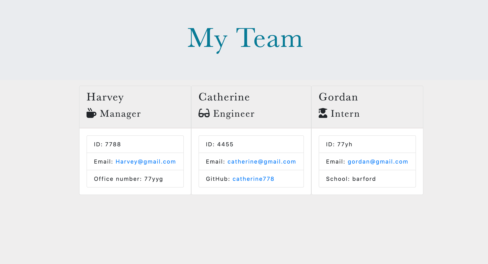

# Team generator app

## Description

The aim of this task was to build a software engineering team generator command line application. The application should prompt the user for information about the team manager and then about any employees and interns. The user can input any number of team members. Once the user inputs all the information an html file is created with all the inputs displayed. This task must also pass all unit tests using jest. 

## Installation
To use this application. Clone the repository and initiate the app using the command line after you have installed all the necessary node dependency files.

## Usage
The app will be useful to companies with team members. You can track each memeber of your team and key information such as name, role, email and github username. It would make it easier to contact one another and keep track of how many people are working at the company and their role.